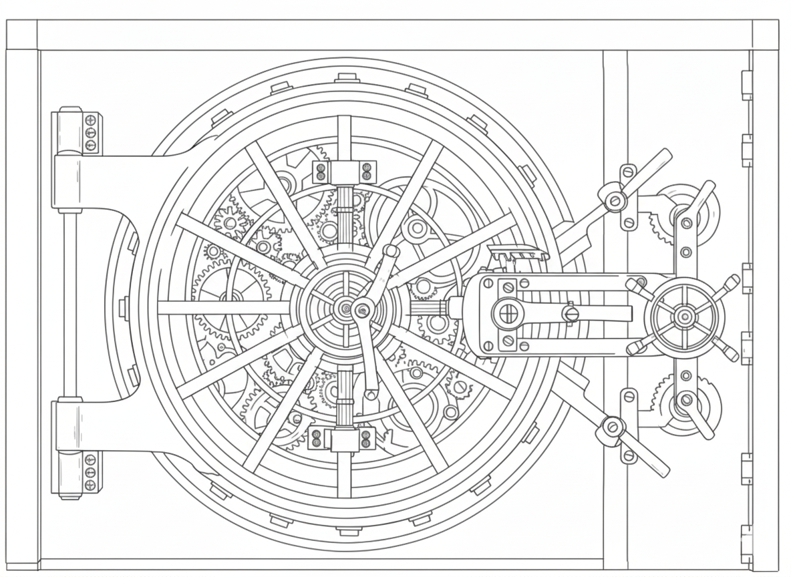

# Secure File Vault
# your secure cloud storage solution


A full-stack application for secure, end-to-end encrypted file storage with client-side encryption and key management.

## Overview

Secure File Vault is designed to provide maximum security for your files through client-side encryption. Files are encrypted in the browser before being sent to the server, ensuring that even the server operator cannot access your files' contents. The system uses modern cryptography techniques including RSA and AES-GCM encryption.



## Key Features

- **End-to-End Encryption**: Files are encrypted in the browser before upload
- **Zero-Knowledge Design**: The server never sees unencrypted files or encryption keys
- **RSA & AES Hybrid Encryption**: Uses RSA for key exchange and AES-GCM for file content
- **User Authentication**: Secure login/registration system with password hashing
- **File Management**: Upload, download, and manage your encrypted files
- **Responsive UI**: Modern interface built with React and Tailwind CSS

## Architecture

The application consists of two main components:

1. **Frontend (React/Vite)**: Handles user interface, authentication, and encryption/decryption
2. **Backend (Node.js/Express)**: Manages user accounts and stores encrypted files

## Security Features

- **Client-side Encryption**: All encryption/decryption happens in the browser
- **Key Management**: Private keys can be exported and saved locally
- **Password Hashing**: PBKDF2 with strong salting for password security
- **No Plain-text Storage**: Only encrypted data is transmitted and stored

## Getting Started

### Prerequisites

- Node.js v22.12+ and npm
- Modern web browser with Web Cryptography API support

### Installation

1. Clone the repository:
   ```bash
   git clone https://github.com/RickyTheDude/secure-file-vault.git
   cd secure-file-vault
   ```

2. Install dependencies for both client and server:
   ```bash
   # Install server dependencies
   cd server
   npm install
   
   # Install client dependencies
   cd ../client
   npm install
   ```

3. Configure port settings if needed (especially for macOS users):
   - Edit `server/config.js` to change the server port
   - Edit `client/src/config/apiConfig.js` to match the server port

### Running the Application

1. Start the server:
   ```bash
   cd server
   node server.js
   ```

2. In a new terminal, start the client:
   ```bash
   cd client
   npm run dev
   ```

3. Open your browser and navigate to `http://localhost:5173`

### Run with Docker (recommended)

1. Build and start containers (script):
   ```bash
   ./run.sh up            # builds and runs in foreground
   ./run.sh up-detach     # builds and runs in background
   ```

   Or use Docker Compose directly:
   ```bash
   docker compose up --build
   ```

2. Open in your browser:
   - Frontend: `http://localhost:3000`
   - Backend health: `http://localhost:5001/health`

3. Logs:
   ```bash
   docker compose logs -f           # all services
   docker compose logs -f server    # backend only
   docker compose logs -f client    # frontend only
   ```

4. Exec into containers (common commands):
   ```bash
   # Open a shell inside the backend container
   docker compose exec server sh

   # Open a shell inside the frontend (nginx) container
   docker compose exec client sh

   # Quick checks inside backend
   docker compose exec server node -v
   docker compose exec server ls -la /app/storage
   docker compose exec server curl -s http://localhost:5000/health | cat
   ```

5. Stop containers:
   ```bash
   ./run.sh down
   # or
   docker compose down
   ```

6. Reset data (deletes LevelDB and stored files):
   ```bash
   ./run.sh down-v
   # or
   docker compose down -v
   ```

## Usage

1. **Registration**: Create an account and securely save your private key
2. **Login**: Authenticate with your username, password, and import your private key
3. **File Management**: Upload files which are automatically encrypted
4. **Download**: Files are automatically decrypted when downloaded

## License

This project is licensed under the MIT License - see the [LICENSE](LICENSE) file for details.


## Acknowledgements

- Web Cryptography API
- React.js
- Node.js
- LevelDB
- Tailwind CSS
